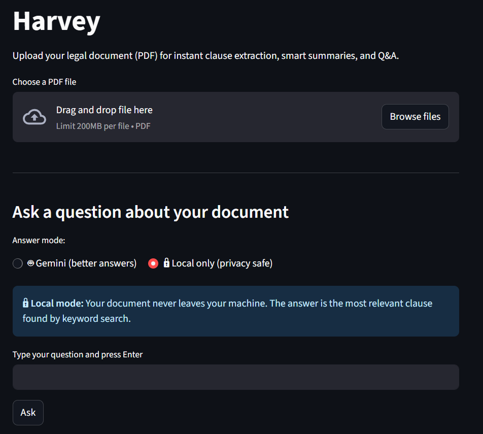
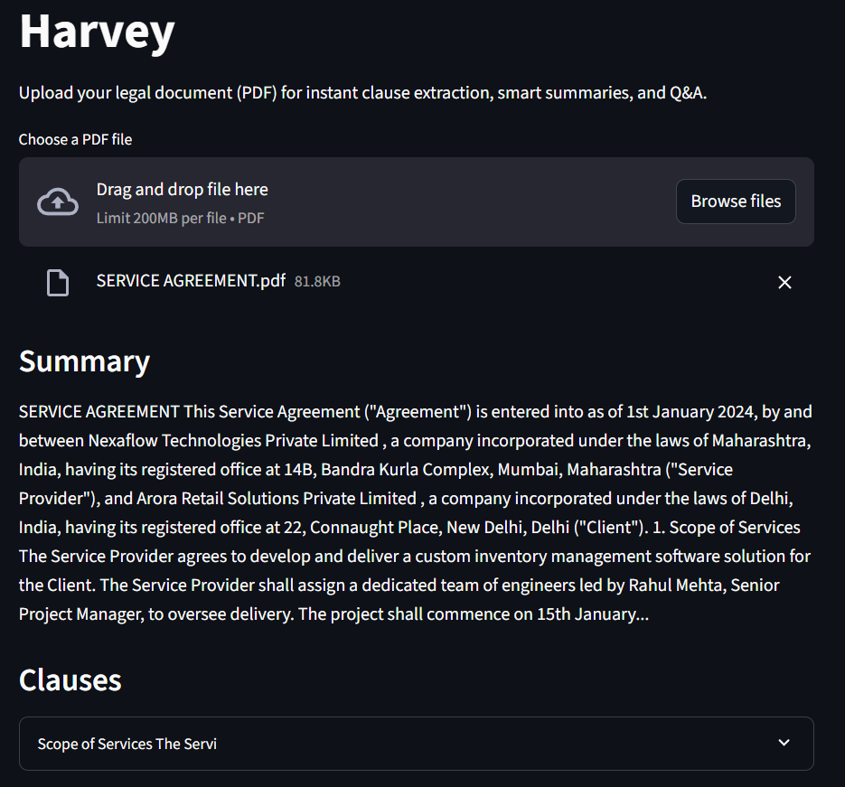
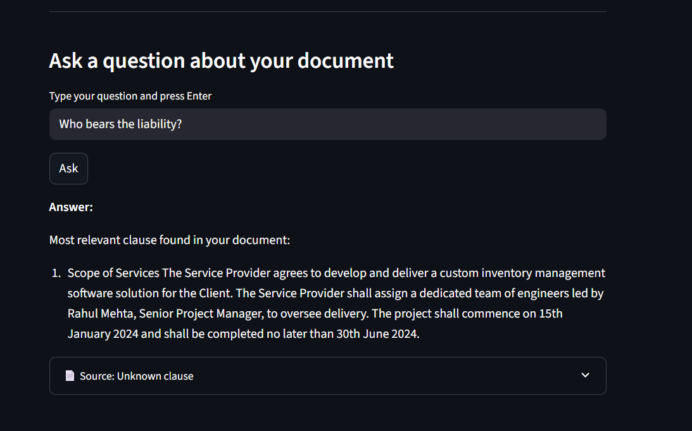

# Harvey
    
Harvey is a legal document analyzer. Named after the sharpest closer in New York — because your contracts deserve the same ruthless attention to detail.

Upload a legal PDF. Harvey reads it, extracts every clause, classifies it, identifies key entities, summarizes the intent in plain English, and lets you interrogate it like a deposition.

---

## Preview

<table>
  <tr>
    <td align="center"><br/><sub>Upload</sub></td>
    <td align="center"><br/><sub>Clauses</sub></td>
    <td align="center"><br/><sub>Q&A</sub></td>
  </tr>
</table>

---

## What Harvey does

- **Clause extraction** — identifies and isolates individual legal clauses using regex-based segmentation with three fallback strategies (numbered headings → heading patterns → paragraphs)
- **Clause classification** — categorizes clauses (payment, confidentiality, termination, liability, intellectual property, governing law, force majeure, dispute resolution, assignment, notice) using SpaCy's rule-based Matcher with token-aware, lemma-based patterns
- **Named Entity Recognition** — extracts people, organizations, dates, and locations from each clause using SpaCy's `en_core_web_sm` NER pipeline
- **Plain-English summarization** — extracts the first two sentences of each clause as a quick summary
- **OCR support** — handles scanned documents and image-based PDFs via Tesseract + pdf2image fallback
- **Document Q&A (two modes)**
  - 🔒 **Local mode** — keyword search finds the most relevant clause, nothing leaves your machine
  - 🤖 **Gemini mode** — opt-in, sends the matched clause to Google Gemini for a natural language answer, with explicit privacy disclosure

---

## Tech Stack


| Component | Technology |
|---|---|
| Clause classification | SpaCy rule-based Matcher (token + lemma patterns) |
| Named Entity Recognition | SpaCy `en_core_web_sm` |
| Q&A — local mode | Keyword overlap search (no external calls) |
| Q&A — Gemini mode | Google Gemini 1.5 Flash (opt-in, privacy-disclosed) |
| OCR | PyTesseract + pdf2image |
| PDF parsing | PyPDF2 → OCR fallback |
| Frontend | Streamlit |
| Backend | FastAPI + Uvicorn |

---

## Getting Started

```bash
git clone https://github.com/DhruvKarani/Harvey.git
cd Harvey
pip install -r requirements.txt
python -m spacy download en_core_web_sm
```

**Terminal 1 — backend:**
```bash
uvicorn app:app --reload --port 8000
```

**Terminal 2 — frontend:**
```bash
streamlit run frontend.py
```

Then open `http://localhost:8501` in your browser.

**Optional — enable Gemini Q&A:**
```bash
# Windows
set GEMINI_API_KEY=your_key_here

# Mac/Linux
export GEMINI_API_KEY=your_key_here
```

---

## Supported Input Formats

- PDF (text-based)
- PDF (scanned / image-based) — via OCR fallback

---

## Project Structure

```
Harvey/
│
├── app.py                  # FastAPI backend — routes, orchestration, Q&A logic
├── classifier.py           # SpaCy Matcher patterns + NER extraction
├── LegalDocAnalyser.py     # Text extraction, clause segmentation, summarization
├── frontend.py             # Streamlit UI
├── clauses_db.json         # Accumulated labeled clauses (grows with usage)
├── data/                   # Sample legal documents
└── uploads/                # User-uploaded files (gitignored)
```

---

## Design Decisions

**Why rule-based classification instead of a transformer?**
Clause classification uses SpaCy's Matcher with handcrafted token and lemma patterns rather than a model like LegalBERT. This was a deliberate choice — The labeled data in clauses_db.json accumulates from document uploads, labeled automatically by the SpaCy Matcher. Manual verification would be required before using this data to train an ML model. Training a classifier on insufficient or noisy data would produce worse results than well-designed rules. The architecture is designed so `classifier.py` can be swapped for an ML model once enough clean labeled examples exist.

**Why two Q&A modes?**
Legal documents contain sensitive information. Sending contract text to an external API is a genuine privacy concern. Local mode keeps everything on the user's machine. Gemini mode is opt-in with an explicit disclosure. For a production deployment, local mode would be replaced with a locally hosted open-source model (e.g. Mistral via Ollama) to eliminate the tradeoff entirely.

---

## Author

**Dhruv Karani** · [LinkedIn](https://www.linkedin.com/in/dhruv-karani-06a03229a/)

